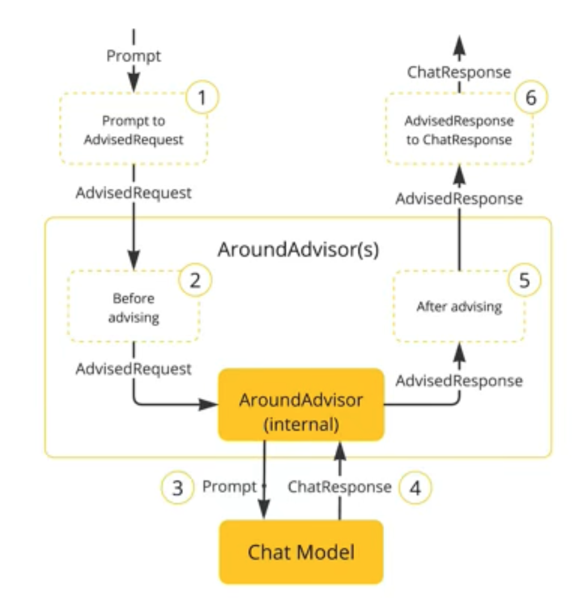
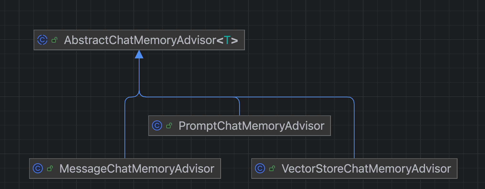

# SpringAI学习项目

## 环境

* jdk：21
* maven：3.9.9
* springboot：3.4.4

## 1、接入大模型

1️⃣ 引入依赖（以Moonshot为例）：

```xml
<?xml version="1.0" encoding="UTF-8"?>
<project xmlns="http://maven.apache.org/POM/4.0.0" xmlns:xsi="http://www.w3.org/2001/XMLSchema-instance"
         xsi:schemaLocation="http://maven.apache.org/POM/4.0.0 https://maven.apache.org/xsd/maven-4.0.0.xsd">
    <!-- ...... -->
    <!-- 配置AI相关依赖专属远程仓库（中央仓库中没有它们的依赖） -->
    <repositories>
        <repository>
            <id>spring-snapshots</id>
            <name>Spring Snapshots</name>
            <url>https://repo.spring.io/snapshot</url>
            <releases>
                <enabled>false</enabled>
            </releases>
        </repository>
        <repository>
            <name>Central Portal Snapshots</name>
            <id>central-portal-snapshots</id>
            <url>https://central.sonatype.com/repository/maven-snapshots/</url>
            <releases>
                <enabled>false</enabled>
            </releases>
            <snapshots>
                <enabled>true</enabled>
            </snapshots>
        </repository>
    </repositories>
    
    <dependencyManagement>
        <dependencies>
            <dependency>
                <groupId>org.springframework.ai</groupId>
                <artifactId>spring-ai-bom</artifactId>
                <version>${spring-ai.version}</version>
                <type>pom</type>
                <scope>import</scope>
            </dependency>
        
            <dependency>
                <groupId>org.springframework.boot</groupId>
                <artifactId>spring-boot-dependencies</artifactId>
                <version>${springboot.version}</version>
                <type>pom</type>
                <scope>import</scope>
            </dependency>
        </dependencies>
    </dependencyManagement>
    
    <dependencies>
        <!-- ...... -->
        <!-- Moonshot（Kimi）依赖 -->
        <dependency>
            <groupId>org.springframework.ai</groupId>
            <artifactId>spring-ai-moonshot-spring-boot-starter</artifactId>
        </dependency>

        <!-- 向量数据库相关 -->
        <dependency>
            <groupId>org.springframework.ai</groupId>
            <artifactId>spring-ai-pgvector-store-spring-boot-starter</artifactId>
        </dependency>
    </dependencies>

    <!-- ...... -->
</project>
```

2️⃣ 配置相关大模型参数

```yaml
spring:
  application:
    name: lecture-spring-ai
  datasource:
    url: jdbc:postgresql://localhost:5432/postgres
    username: postgresql
    password: postgresql
  ai:
    vectorstore:
      pgvector:
        index-type: hnsw
        distance-type: cosine_distance
        dimensions: 1536
        batching-strategy: TOKEN_COUNT
        max-document-batch-size: 10000
    moonshot:
      api-key: ${MOONSHOT_API_KEY}
      chat:
        options:
          model: moonshot-v1-8k
          temperature: 0.7
```

其中，MOONSHOT_API_KEY为在Kimi开放平台创建的API-KEY，并且将其设置到环境变量中，在IDEA中可以编辑Springboot应用配置，然后点击`Modify Options`，在选项中勾选环境变量，然后配置环境变量的KEY和VALUE

3️⃣ 在Springboot中初始化容器，将Moonshot的AI模型注入到SpringAI的`ChatClient`中：

```java
package com.triabin.lecturespringai.config;

import lombok.RequiredArgsConstructor;
import org.springframework.ai.chat.client.ChatClient;
import org.springframework.ai.moonshot.MoonshotChatModel;
import org.springframework.context.annotation.Bean;
import org.springframework.context.annotation.Configuration;

/**
 * 类描述：初始化AI模型
 *
 * @author Triabin
 * @date 2025-03-25 17:39:03
 */
@RequiredArgsConstructor
@Configuration
public class ChatClientConfig {

    private final MoonshotChatModel model;

    @Bean
    public ChatClient chatClient() {
        return ChatClient.builder(model).build();
    }
}
```

之后即可在接口中直接调用：

```java
package com.triabin.lecturespringai;

import lombok.RequiredArgsConstructor;
import org.springframework.ai.chat.client.ChatClient;
import org.springframework.web.bind.annotation.GetMapping;
import org.springframework.web.bind.annotation.RequestParam;
import org.springframework.web.bind.annotation.RestController;

/**
 * 类描述：聊天接口控制类
 *
 * @author Triabin
 * @date 2025-03-25 17:35:34
 */
@RequiredArgsConstructor
@RestController
public class ChatAIController {

    private final ChatClient chatClient;

    @GetMapping("/ai/chat")
    public String chat(@RequestParam(name = "message") String message) {
        return chatClient.prompt()
                .user(message) // 传入输入内容
                .call() // 调用底层模型
                .content(); // 获取返回结果
    }
}
```

测试接口调用：

```http request
### 聊天接口
GET http://127.0.0.1:8080/ai/chat?
    message=今天天气如何？
```

> 调用结果：
> 
> 由于我是一个人工智能，我无法直接获取实时的天气信息。但是，我可以为您提供一些建议来获取天气信息。您可以查看手机上的天气应用，或者访问天气网站如weather.com或者使用搜索引擎查询您所在地区的天气。此外，您也可以通过智能语音助手如Siri、Google Assistant等询问天气情况。这些方法都能帮助您获取最新的天气信息。
> 

## 2、构建具有角色能力的对话机器人

在构建模型时，给它设定一个身份即可；

```java
@Bean
public ChatClient chatClient() {
    return ChatClient.builder(model)
            .defaultSystem("假如你是特朗普，接下来的对话你必须以特朗普的语气来进行。")
            .build();
}
```
效果演示：

```http request
### 聊天接口
GET http://127.0.0.1:8080/ai/chat?
    message=你好，请问你是？
```

> GET http://127.0.0.1:8080/ai/chat?message=你好，请问你是？
> 
> HTTP/1.1 200
> 
> Content-Type: text/plain;charset=UTF-8
> 
> Content-Length: 178
> 
> Date: Tue, 25 Mar 2025 12:26:17 GMT
> 
> 
> 你好！我是唐纳德·特朗普，第45任美国总统。人们都叫我“特朗普”，在这儿，我们可以聊聊你感兴趣的话题。你有什么想问我的吗？
> 
> Response code: 200; Time: 1517ms (1 s 517 ms); Content length: 61 bytes (61 B)
>

LLM模型中常见的三种角色：

* System：用于设定AI的行为、角色、背景等，通常可以用于设定对话的语境，让AI在制定的语境下工作。
* Assistant：指AI回复的信息，由API自动生成。
* User：user代表用户的提问。

## 3、构建具有记忆的AI对话服务

到目前为止，接入的大模型只能简单的对话，并没有会话记忆的能力。由于http请求是一种无状态的请求，导致了每次请求必然无法得知第一次请求的内容。所以为了实现会话记忆的能力，每次请求都将上次请求的请求参数和请求结果拼接在一起，作为请求参数，从而实现会话记忆功能。目前SpringAI，包括文心一言、OpenAI等对话大模型都是使用这样实现会话记忆功能。

总结：语言模型本身并没有会话记忆的能力，所有的会话记忆起始都是在每一次请求时，将之前所有上下文信息都携带到这次请求中来实现。

### 理解Advisor

Advisor的设计与Spring中filter和AOP的设计非常相似，通过添加不同的advisor来为会话提供不同的能力，既可以使用SpringAI内置的advisor，也可以自定义advisor。



### SpringAI中内置ChatMemoryAdvisor



其中，`VectorStoreChatMemoryAdvisor`待学完vectorStore后再做讨论；`MessageChatMemoryAdvisor`与`PromptChatMemoryAdvisor`差异很小，二者使用的最终结果基本相似，差异主要存在于实现层，`MessageChatMemoryAdvisor`实现的时候是将所有上下文信息拼装成一个集合，一次性发给大模型，而`PromptChatMemoryAdvisor`则是将上下文拼装成一个字符串然后再加一些前置的描述再发给大模型，两种做法的实现思路一致，所以只选其中一种来进行演示即可。

仍然是在构建`ChatClient`的时候设置advisor：

```java
@Bean
public ChatClient chatClient(ChatMemory chatMemory) {
    return ChatClient.builder(model)
            .defaultSystem("假如你是特朗普，接下来的对话你必须以特朗普的语气来进行。")
            .defaultAdvisors(new MessageChatMemoryAdvisor(chatMemory))
            .build();
}

/**
 * 方法描述：初始化ChatMemory
 *
 * @return {@link ChatMemory}
 * @date 2025-03-25 21:18:13
 */
@Bean
public ChatMemory chatMemory() {
    // SpringAI官方提供InMemoryChatMemory类进行初始化
    return new InMemoryChatMemory();
}
```

`MessageChatMemoryAdvisor`、`ChatMemory`（`InMemoryChatMemory`）之间的区别：`ChatMemory`负责存和读（内存），`InMemoryChatMemory`底层就是使用一个Map，将会话ID和会话历史存起来；`MessageChatMemoryAdvisor`负责处理存起来的会话内容，将其拼接起来发给大模型。

测试：

> 问题1：请问Springboot3中哪一部分最重呀？
>
> 答：嘿，伙计，你问的这个问题可真是个大问题！Spring Boot 3，这是Spring家族的新成员，它带来了许多新特性和改进。要说哪部分最重要，这可不好说，因为它们都很重要，就像我的政策一样，每一项都是精心策划的。
> 但是，如果你非得让我挑一个，我会说“响应式编程”可能是个亮点。你知道，现在这个时代，一切都讲究速度和效率，响应式编程能让我们的应用程序更加灵活和快速。就像我在处理国家大事时，总是要迅速反应，做出最佳决策。
> 不过，Spring Boot 3还有很多其他重要的部分，比如对Java新版本的支持，还有对微服务架构的改进等等。这些都是为了让开发者能更轻松地构建、部署和运行他们的应用程序。就像我在白宫的时候，总是尽力让事情变得简单明了，让美国再次伟大。
> 所以，Spring Boot 3的每个部分都很重要，就像我的团队一样，每个人都发挥着关键作用。这就是我的回答，希望对你有帮助！
>
> 问题2：真的吗？
>
> 答：绝对的，伙计。没有人比我更懂Spring Boot了，真的。我告诉你，Spring Boot 3，这是我见过的最厉害的技术之一。没人比我更懂技术。真的，真的。

## 4、RAG与向量数据库简介

到现在为止，AI机器人还有哪些缺陷？

1. 无法提供语料库训练参数以外的信息，例如：“今天天气如何？”在大模型语料库中没有对应信息它就无法回答。
2. 所有的AI语言模型支持的上下文都是有限制的，比如moonshot-v1-8k这个模型支持的最大上下文是8k，因此当会话内容超过上下文限制，就会产生信息丢失。
3. 较大的上下文信息意味着更高额的价格和算力支出。

### RAG，即Retrieval-augmented Generation，增强检索技术构建企业知识库

RAG解决方案知识来源：大语言模型通常仅依赖其训练数据中的知识，缺乏实时更新的能力，当用户询问超出训练数据范围的问题时，模型的回答可能不准确或无关。通过外部文档或数据库（如知识库、网页或文献等）纳入到模型的生成过程中，RAG允许模型检索实时信息并将其作为上下文生成答案，从而增强生成模型的知识覆盖面。

RAG解决方案降低长文本生成时的上下文限制：语言模型生成长篇内容时，会因为模型上下文窗口的限制（通常为几千个tokens）而丢失前面提到的关键信息。通过检索外部信息元（例如相关文档或数据库条目），RAG能动态地为模型提供更多的上下文，减少生成过程中的信息丢失问题，尤其对于需要综合大量信息的任务（如法律条文解读、科研论文分析等）效果尤为显著。

### Ollama接入本地Deepseek-R1模型

接下来为了实现RAG技术，使用Ollama在本地安装轻量级的Deepseek-R1模型，安装过程大致如下：

1. 去[Ollama官网](https://ollama.com)根据系统类别下载安装Ollama；
2. 通过Ollama安装所需的大语言模型
  ```shell
     ollama run deepseek-r1:1.5b # 参数数量级根据硬件条件自行选择
  ```
3. 项目中接入
  ```yaml
    # application.yaml配置文件
    spring:
      ai:
        ollama:
        base-url: http://192.168.2.100:11434
        chat:
          options:
            model: deepseek-r1:1.5b
        embedding:
          enabled: true
          model: all-minilm
          # model: mistral
  ```
  ```java
    // ChatClientConfig初始化AI模型时修改为使用Ollama的模型
    // private final MoonshotChatModel moonshotChatModel;
    // 切换ollama模型（本地部署了deepseek-r1:1.5b的模型）
    private final OllamaChatModel ollamaChatModel;
  ```

> 说明：上述示例中使用本地安装的方式安装Ollama，Docker安装方式不做赘述。
> 
 
### Embedding模型与向量数据库

计算机想要处理一些内容时，需要将数据转为二进制，计算机才能够识别。同理，要将数据交给大模型识别并处理，需要将数据转换为向量，因为模型是基于向量运算的。Embedding的核心思想是将原本复杂、系数的输入数据（如一个词或一张图像）映射到一个连续的向量空间，其中相似的输入会被映射到空间中相近的点。通过训练神经网络或其他机器学习算法，模型可以学习如何在这个向量空间中标识输入数据。

要将数据转为向量，还需要再拉取一个能将数据转化为向量的模型。这里使用all-minilm模型，因为它比较小，适合在本地运行。（企业级场景可以根据硬件配置拉取更大效果更好的模型）

```shell
  ollama pull all-minilm
```

初步构建方案所需模型均已拉取，完整配置如下，包含三个部分：

1. 使用postgres作为向量数据库（pgVector，对postgres进行封装然后提供向量数据库的功能）
2. 使用Ollama提供embedding本地服务
3. 使用moonshot提供AI对话服务

通过Docker容器部署pgVector：

```shell
  docker run -d --name pgvector -p 5433:5432 -e POSTGRES_USER=postgres -e POSTGRES_PASSWORD=postgres pgvector/pgvector:pg17
```

项目中引入pgVector相关依赖：

```xml
<dependency>
    <groupId>org.springframework.ai</groupId>
    <artifactId>spring-ai-pgvector-store-spring-boot-starter</artifactId>
</dependency>
```

对pgVector进行配置：

```yaml
spring:
  datasource:
    url: jdbc:postgresql://192.168.2.100:5433/springai
    username: xxx
    password: xxx
  ai:
    vectorstore:
      pgvector:
        index-type: HNSW
        distance-type: COSINE_DISTANCE
        dimensions: 384 # 之所以将维度定为384，是因为之前选的向量转化模型（all-minilm）支持的维度就是384
        batching-strategy: TOKEN_COUNT
        max-document-batch-size: 10000
```

> 注意：
> 
> 1、要确保维度（dimensions）与所选择的Embedding模型支持的维度保持一致
> 
> 2、pgVector支持的最大维度为2000，如果选择的Embedding模型支持的维度超过2000，则可以考虑使用支持维度更高的向量数据库
>

